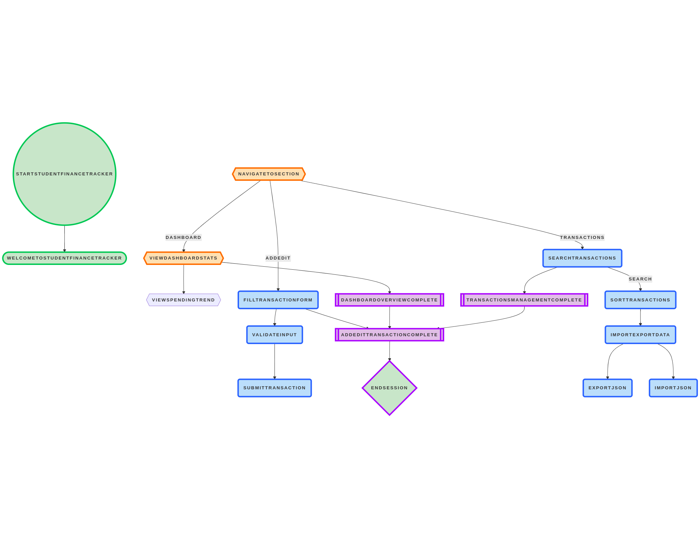

# Student Finance Tracker

Track your student expenses, see your spending trends, and manage your budget—all in one simple web app!  
Built with **HTML**, **CSS**, and **JavaScript**.  
Designed to be accessible, responsive, and easy for anyone to use.

---

## Live Demo

Try it now on GitHub Pages:  
[Student Finance Tracker Live](https://arianeitetero.github.io/StudentFinanceTracker_Summative/)

## Repository

View the source code and all files:  
[Student Finance Tracker Repo](https://github.com/arianeitetero/StudentFinanceTracker_Summative)

## Demo Video

Watch a short walkthrough (with keyboard navigation, regex edge cases, and import/export):  
[Student Finance Tracker YouTube Demo](https://www.youtube.com/watch?v=1yqIOqKdEX8)

---

## About This App

**Student Finance Tracker** helps you manage your personal finances as a student:
- Add, edit, and delete your transactions (like purchases or income)
- See your total spending, top categories, and weekly trends
- Set a monthly cap and get alerts if you go over
- Save your data, export/import as JSON, and customize settings

---

## Spec & Wireframes

- **Wireframes/Sketches:**  
  
- **Data Model:**  
  Each transaction is an object like:  
  `{ id, description, amount, category, date, createdAt, updatedAt }`
- **Accessibility Plan:**  
  - Uses semantic HTML5 tags for structure  
  - ARIA live regions to announce changes/errors  
  - Full keyboard navigation (with skip link and visible focus)  
  - Proper heading order and form labels

---

## Features

- Add, edit, and delete transactions
- Dashboard shows total spent, transaction count, top category, and 7-day trend (text, not charts)
- Sort transactions by date, description, or amount
- Live regex search (safe, highlights matches)
- Data saved in your browser (LocalStorage)
- Import/export JSON (with validation)
- Settings for categories, currency, and monthly cap
- Mobile-first, responsive layout (table on desktop, cards on mobile)
- Accessible: ARIA live regions, keyboard, and screen reader support
- Animated UI: Smooth section transitions and button/card feedback

---

## How to Run the App Locally

> **Important:** Don’t open `index.html` by double-clicking.  
> Use a local server for everything to work!

### Option 1 – Python (works everywhere)
```bash
python -m http.server 8000
```
Then open [http://localhost:8000/index.html](http://localhost:8000/index.html) in your browser.

### Option 2 – VS Code Live Server
- Install the "Live Server" extension
- Right-click `index.html` and choose **Open with Live Server**

---

## How to Run Tests

1. Open `tests.html` in your browser.
2. Try the example inputs or type your own.
3. Green means the regex passed, red means it failed.
4. No server needed for `tests.html`.

---

## How to Import Seed Data

- Go to **Settings** in the app.
- Click **Import JSON** and select your `seed.json` file.
- Your transactions will appear in the list!

---

## How to Use Main Features

- **Add/Edit:**  
  Fill out the form, press Enter to save. Errors show if inputs are wrong.
- **Regex Validation:**  
  Try bad values (like double spaces or invalid amounts) to see friendly error messages.
- **Regex Search:**  
  Enter patterns in the search box (e.g., `coffee|tea`) to highlight matches.
- **Sort:**  
  Use the sort buttons to reorder transactions.
- **Dashboard:**  
  See stats update as you add or delete items.
- **Cap Logic:**  
  Set your monthly cap in Settings. If you go over, you’ll get a clear alert.
- **Settings:**  
  Change categories and currency. The dropdown updates right away.
- **Import/Export:**  
  Use the buttons in Transactions or Settings to backup or restore your data.

---

## Regex Catalog

| Field        | Pattern                                      | Example                  |
|--------------|----------------------------------------------|--------------------------|
| Description  | `/^\S(?:.*\S)?$/`                            | Lunch at cafeteria       |
| Amount       | `/^(0|[1-9]\d*)(\.\d{1,2})?$/`               | 12.34, 0                 |
| Date         | `/^\d{4}-(0[1-9]|1[0-2])-(0[1-9]|[12]\d|3[01])$/` | 2025-09-28       |
| Category     | `/^[A-Za-z]+(?:[ -][A-Za-z]+)*$/`            | Food, Entertainment      |
| Advanced     | `/\b(\w+)\s+\1\b/` (duplicate words)         | coffee coffee            |

*Date validation also blocks dates before today.*

---

## Keyboard Map

| Action                    | Key                     |
|---------------------------|-------------------------|
| Move between fields       | Tab / Shift + Tab       |
| Submit form               | Enter                   |
| Cancel edit               | Esc                     |
| Skip to main content      | Tab (to skip link) or Alt + S |
| Sort/select (where available) | Arrow keys          |

---

## Accessibility Notes

- Uses semantic HTML5 landmarks (`header`, `nav`, `main`, `section`, `footer`)
- Proper heading hierarchy
- All form inputs have labels (`for` and `id`)
- Visible focus outlines for keyboard users
- Skip-to-content link for quick navigation
- ARIA live regions for error/status messages and dashboard updates
- Full keyboard navigation—no mouse required!
- Color contrast checked for WCAG AA/AAA

---

## Wireframes

Dashboard & Navigation:  


---

## Contact

GitHub: [arianeitetero](https://github.com/arianeitetero)  
Email: a.itetero@alustudent.com

---